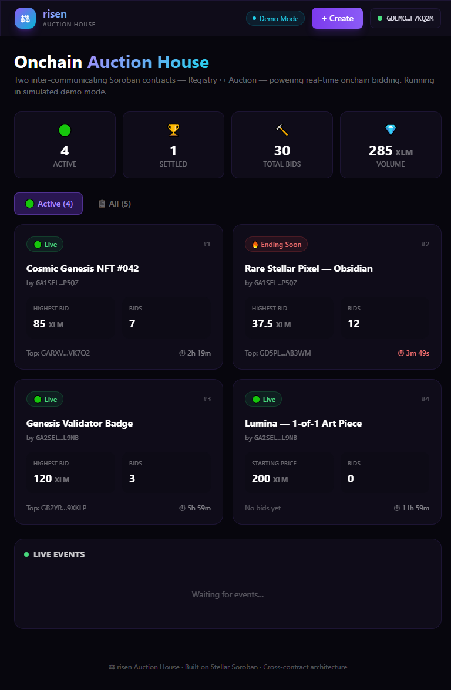
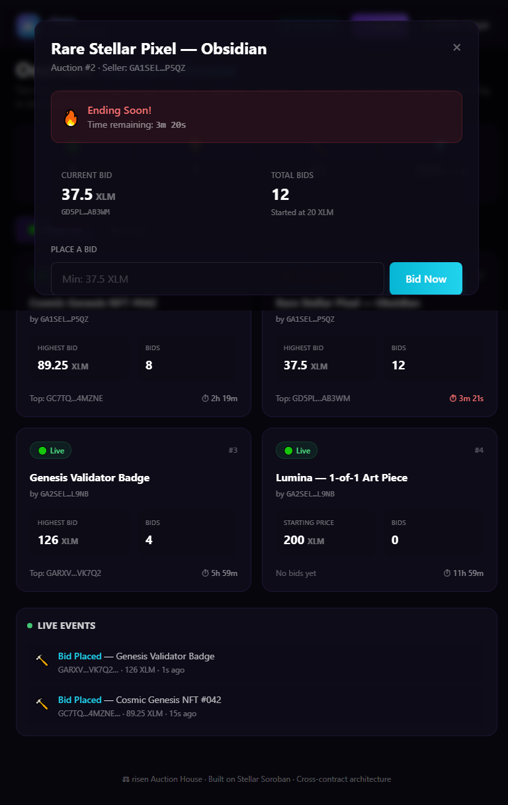
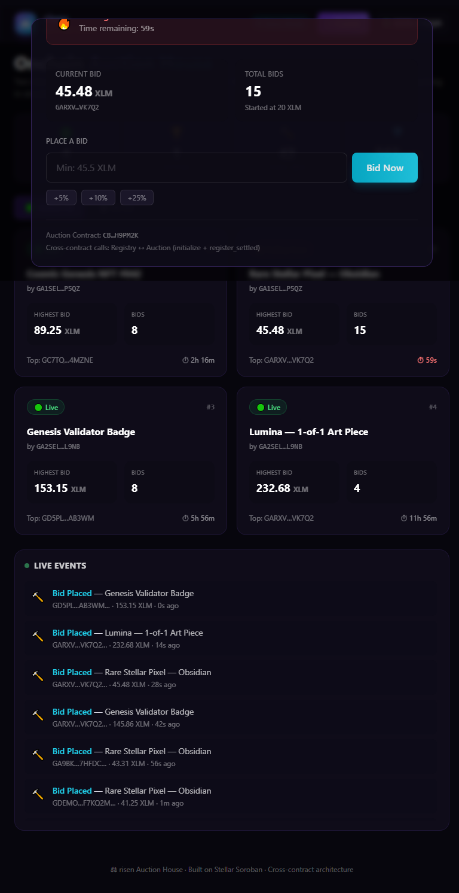
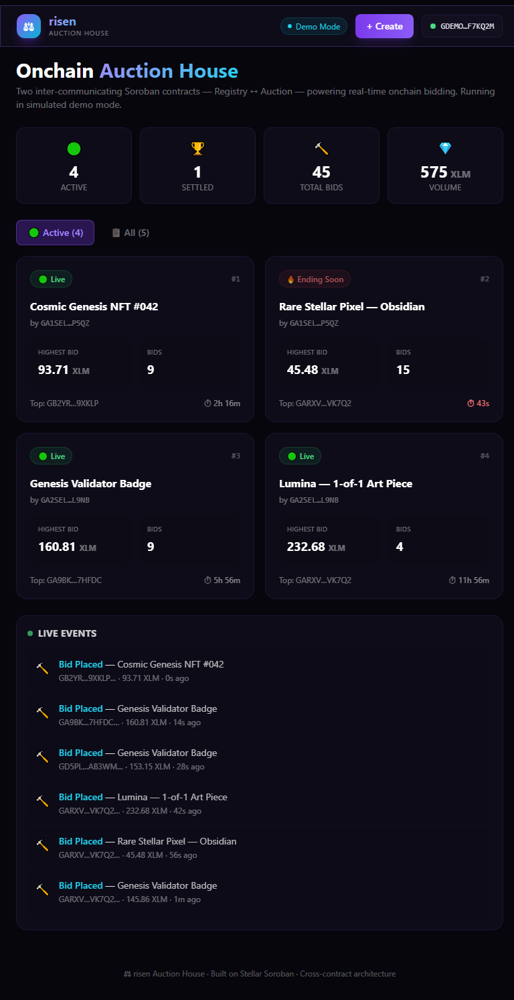

# ✦ risen — Orange Belt (Level 3)

**A fully on-chain real-time auction house on Stellar with two inter-communicating Soroban smart contracts, live event streaming, and a polished React frontend.**


---

Built for the **Stellar Frontend Challenge — Level 3 (Orange Belt)**. This project implements a complete onchain auction house with **two inter-communicating Soroban contracts**, real-time event streaming, and a production-ready React frontend.

## 🏗️ Architecture

### Two Inter-Communicating Contracts

```
┌─────────────────────────────────────────────────┐
│                  REGISTRY                        │
│  (AuctionRegistry — the "core" contract)         │
│                                                  │
│  • initialize(admin, token)                      │
│  • create_auction(auction_addr, ...) ────────────────┐
│  • list_active / list_all                        │  │ cross-contract call
│  • get_auction(id)                               │  ▼
│  • register_settled(id, winner, price) ◄──────┐  │
│  • auction_count                               │  │
└────────────────────────────────────────────────┘  │
                                                   │
┌────────────────────────────────────────────────┐  │
│                  AUCTION                         │  │
│  (AuctionContract — one instance per auction)    │  │
│                                                  │  │
│  • initialize(params) ◄──────────────────────────┘
│  • place_bid(bidder, amount)                     │
│  • get_state()                                   │
│  • settle() ──────────────────────────────────────┘
│         (calls register_settled on registry)
└──────────────────────────────────────────────────┘
```

**Cross-contract communication:**
- **Registry → Auction**: When `create_auction` is called, the registry performs a cross-contract call to `AuctionClient::initialize` on the new auction instance.
- **Auction → Registry**: When `settle` is called on an auction, it calls `RegistryClient::register_settled` back on the registry to update the global state.

### Shared Types Crate
A dedicated `shared` crate holds all `#[contracttype]` structs and `#[contractclient]` traits, avoiding circular dependencies between the two contract crates.

## ✨ Features

- 🔗 **Two inter-communicating Soroban contracts** — registry creates and tracks auctions; auctions call back to the registry on settle
- 🏠 **Auction creation** — sellers create new auctions with item name, starting price, and duration
- 🔨 **Live bidding** — place bids with real on-chain transactions; previous bidder is automatically refunded
- ⏱️ **Countdown timers** — live time-remaining display per auction
- 📡 **Real-time event feed** — streams `BidPlaced`, `AuctionInitialized`, `AuctionSettled` events
- 📋 **Transaction status tracking** — full lifecycle: preparing → signing → submitting → pending → confirmed/failed
- 🏆 **Auction settlement** — after end time, settle pays the seller and records the winner
- 🦊 **Multi-wallet support** — via `@creit.tech/stellar-wallets-kit`
- 📱 **Mobile responsive** — works on all screen sizes
- 🤖 **CI/CD** — GitHub Actions workflow builds + tests contracts and frontend on every push
- 🧪 **Contract tests** — comprehensive unit tests for the auction contract

## 🧱 Tech Stack

| Layer | Tech |
| --- | --- |
| Smart Contracts | Rust, Soroban SDK |
| Frontend | React 18, Vite, TypeScript |
| Styling | TailwindCSS 3 |
| Wallet | @creit.tech/stellar-wallets-kit |
| Chain | @stellar/stellar-sdk 16 (Soroban RPC) |
| CI/CD | GitHub Actions |

## 📦 Project Structure

```
risen-orange_300/
├── contracts/
│   ├── shared/             # Shared types + cross-contract client traits
│   │   └── src/lib.rs      # AuctionInfo, AuctionState, RegistryTrait, AuctionTrait
│   ├── registry/           # Registry contract (core)
│   │   └── src/lib.rs      # create_auction, list_active, register_settled
│   └── auction/            # Auction contract (per-instance)
│       ├── src/lib.rs      # place_bid, settle, get_state
│       └── src/test.rs     # Unit tests
├── frontend/               # React dApp
│   └── src/
│       ├── components/     # AuctionCard, BidPanel, EventFeed, Header, TransactionLog
│       ├── hooks/          # useAuctions, useWallet
│       ├── lib/            # contract.ts, wallet.ts, demo.ts, config.ts
│       └── App.tsx
├── .github/workflows/ci.yml
└── screenshots/
```

## 🚀 Getting Started

### Prerequisites
- Rust + Soroban SDK (for contracts)
- Node.js 18+ (for frontend)

### Contracts

```bash
cd contracts/auction
cargo test                    # run unit tests
soroban contract build        # compile to WASM
```

### Frontend

```bash
cd frontend
npm install
npm run dev                   # starts on http://localhost:5182
```

For production:
```bash
npm run build
npm run preview
```

### Demo Mode

Set `VITE_DEMO_MODE=true` in `frontend/.env.local` to run without a wallet or deployed contracts. The app simulates the full auction house experience in-memory.

## 🖼️ Screenshots

| # | State | Screenshot |
| --- | --- | --- |
| 1 | Auction house — active auctions grid |  |
| 2 | Bidding — placing a bid on an auction |  |
| 3 | Bid confirmed — transaction status + hash |  |
| 4 | Live event feed — real-time events |  |

## 🧪 Tests

```bash
cd contracts/auction
cargo test
```

Tests cover:
- Auction initialization
- Bidding with valid/invalid amounts
- Outbid refund logic
- Settlement after end time
- Double-settle prevention

## 📄 License

MIT © 2026 risen
